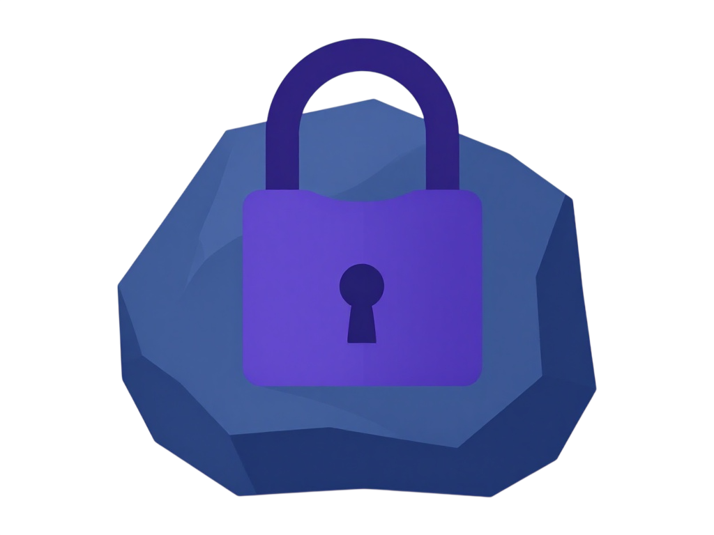

  

<h1 align="center">Bornite</h1>

  Open-source, risk-based vulnerability management (RBVM).

  
  
  
  = 20">
  
  
  

---

Security scanners produce far more findings than any team can ever fix. Bornite
brings them together — from network, application, dependency, cloud and code
scanners — removes the duplicates, and ranks what remains by real, contextual
risk. The goal is simple: help teams work on the vulnerabilities that actually
matter, first.

## Status

Bornite is in early development. This repository currently contains the core
model of the platform; more will follow.

## License

Bornite is licensed under the **GNU Affero General Public License v3.0 or later**
(AGPL-3.0-or-later) — see [`LICENSE`](LICENSE).

Inspired by DefectDojo — see [`ACKNOWLEDGEMENTS.md`](ACKNOWLEDGEMENTS.md).
